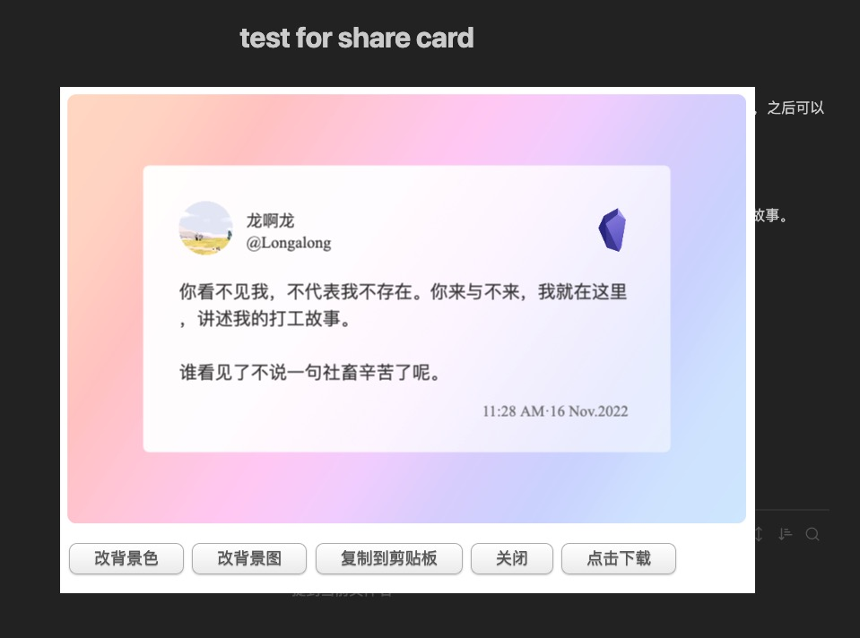

## sharecard

sharecard 是用来生成分享卡片的。目前仅适配 obsidian，之后可以弄成一个支持 web 的工具，也可以弄一个 serverless 接口。

## 展示

比如，你有这样一段文字
```text
你看不见我，不代表我不存在。你来与不来，我就在这里，讲述我的打工故事。

谁看见了不说一句社畜辛苦了呢。
```

你可以让她成为这样


或者成为这样


## 项目起源

在使用 [obsidian](https://obsidian.md/) 时，希望能将写的一些句子变成具有背景的图片卡片。

于是在朋友的推荐下找到了 [文字卡片-Templater](https://zji.me/4b5b6eff-310e-407a-9263-6cba4cebf626/) 的方案，该方案是借助 [Templater](https://silentvoid13.github.io/Templater/) 的 prompt 能力，将输入的文字放入 canvas 中，最后将 canvas 导出为图片。

使用过程中，发现该项目能满足一些基本的需求，但交互上不是很友好，因此决定写一个交互更友好的分享卡片功能。

本着快速作出 demo 的心态，一天之后，一个粗糙的(各方面)分享卡片就诞生了。

> 过程中还找到了 [poet.so](https://poet.so/) 这个项目，参考了背景色的样式


## 快速试用

1. 目前还是使用 Templater 的自定义 script 注入功能，因此，需要将本项目下的 sharecard/sharecard.js 放入到 templater 的 scripts 目录下，并刷新。


2. 创建一个 模板文件，该文件充当配置，内容如下：

```js
<% tp.user.sharecard(tp, { 
 userName: '龙啊龙', 
 nameID: '@Longalong',
 avatarUrl: `https://xxx.xxx.xxx/xxx.jpg`, // 头像地址，可填写 url、 base64
 logoUrl: `./ob.png` // logo地址，默认是一个 ob 的 logo
}) %>
```

3. 设置一个创建模板的命令


4. 选中一段你想分享的语句


5. cmd(ctl) + p 并输入 template 的名字


6. 改改自己喜欢的背景



## 简单总结

- 满足基本使用需求
- 代码很粗糙，完全没有工程化
- 交互还不大友好
- 自定义能力很弱

## 后续计划

- [ ] 默认样式增加阴影
- [ ] 项目工程化改造
- [ ] 支持自定义样式
- [ ] 支持自定义调整
- [ ] 支持网页版使用
- [ ] 用插件的方式支持 obsidian 安装

# 想法

一个能真正被大家用起来的项目，是需要精雕细琢的，这正是 产品 和 设计师 所锚定的价值。
技术在项目中，不过是一个工具，当然这个工具很重要。
